# Sơ đồ Sequence của Data Cleaner

Cập nhật ngày 26/11/2026. Các sơ đồ mô tả thứ tự trao đổi giữa người dùng, React, FastAPI, PostgreSQL và kho tệp.

Các API yêu cầu đăng nhập kiểm tra Bearer JWT và giới hạn truy vấn tệp, job theo chủ sở hữu. Khi xác thực thất bại, API trả HTTP 401.

## Cách xem sơ đồ

Mở tài liệu trong trình đọc Markdown hỗ trợ Mermaid hoặc mở draw.io và chọn **Arrange → Insert → Mermaid**. Sao chép một khối, bắt đầu từ dòng `sequenceDiagram`, bỏ hai dòng dấu rào Markdown rồi bấm **Insert**.

Đọc từ trên xuống. Mũi tên liền chỉ yêu cầu hoặc thao tác. Mũi tên nét đứt chỉ phản hồi. Các khối `alt`, `opt` và `loop` biểu diễn nhánh, điều kiện và bước lặp.

Xem thêm [đặc tả Use Case](Use-case-Data-Cleaner.md) và [sơ đồ Activity](So-do-activity.md).

## 0. Trang khách và yêu cầu đăng nhập

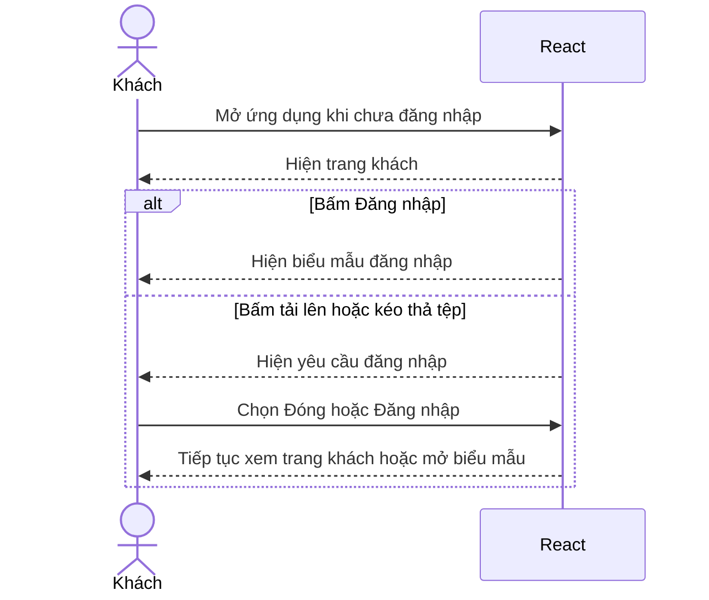
```mermaid
sequenceDiagram
    actor U as Khách
    participant UI as React
    U->>UI: Mở ứng dụng khi chưa đăng nhập
    UI-->>U: Hiện trang khách
    alt Bấm Đăng nhập
        UI-->>U: Hiện biểu mẫu đăng nhập
    else Bấm tải lên hoặc kéo thả tệp
        UI-->>U: Hiện yêu cầu đăng nhập
        U->>UI: Chọn Đóng hoặc Đăng nhập
        UI-->>U: Tiếp tục xem trang khách hoặc mở biểu mẫu
    end
```

## 1. Đăng ký

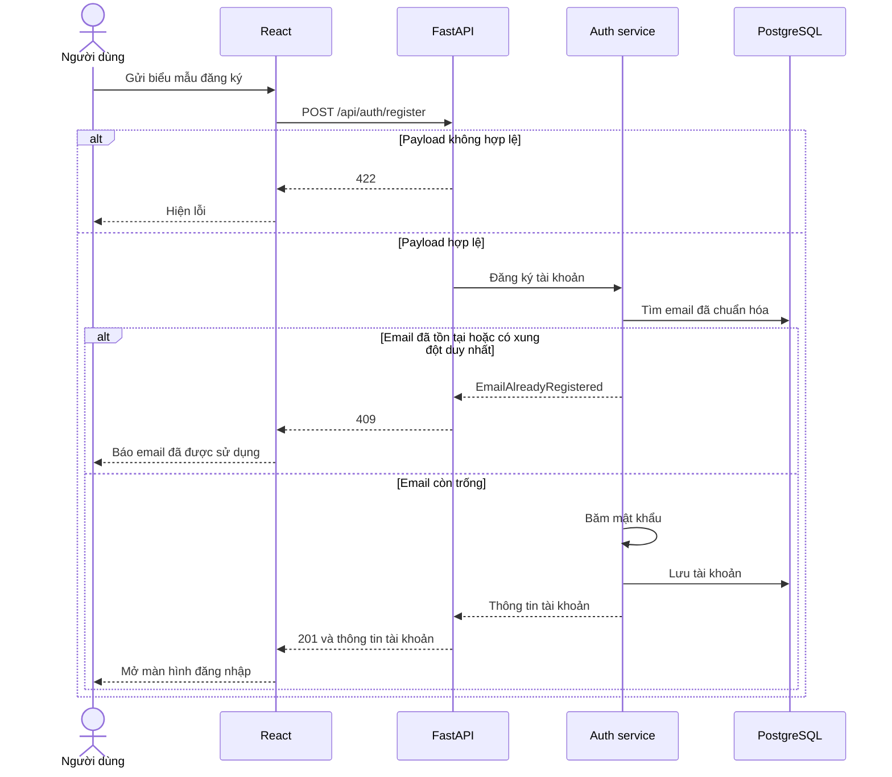
```mermaid
sequenceDiagram
    actor U as Người dùng
    participant UI as React
    participant API as FastAPI
    participant S as Auth service
    participant DB as PostgreSQL
    U->>UI: Gửi biểu mẫu đăng ký
    UI->>API: POST /api/auth/register
    alt Payload không hợp lệ
        API-->>UI: 422
        UI-->>U: Hiện lỗi
    else Payload hợp lệ
        API->>S: Đăng ký tài khoản
        S->>DB: Tìm email đã chuẩn hóa
        alt Email đã tồn tại hoặc có xung đột duy nhất
            S-->>API: EmailAlreadyRegistered
            API-->>UI: 409
            UI-->>U: Báo email đã được sử dụng
        else Email còn trống
            S->>S: Băm mật khẩu
            S->>DB: Lưu tài khoản
            S-->>API: Thông tin tài khoản
            API-->>UI: 201 và thông tin tài khoản
            UI-->>U: Mở màn hình đăng nhập
        end
    end
```

## 2. Đăng nhập, khôi phục phiên và đăng xuất

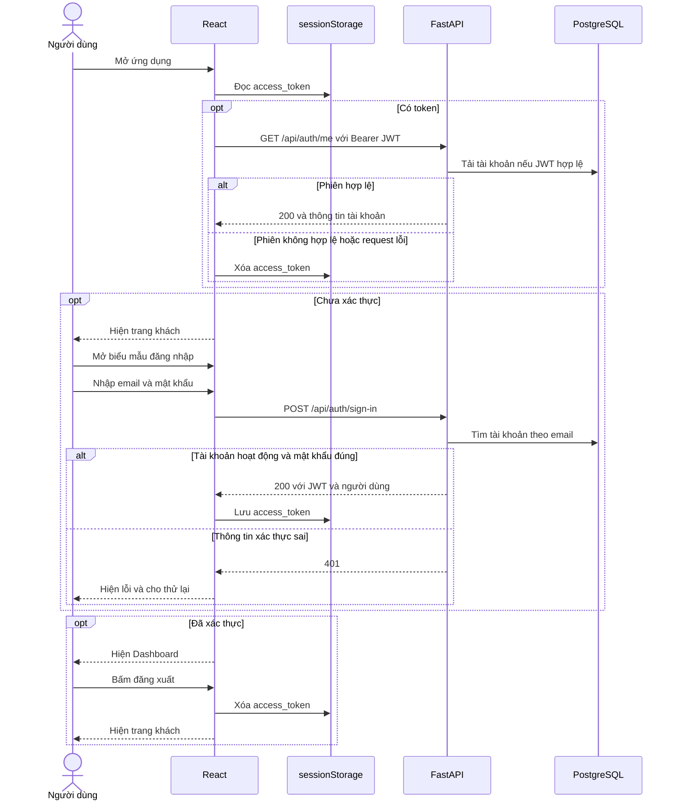
```mermaid
sequenceDiagram
    actor U as Người dùng
    participant UI as React
    participant SS as sessionStorage
    participant API as FastAPI
    participant DB as PostgreSQL
    U->>UI: Mở ứng dụng
    UI->>SS: Đọc access_token
    opt Có token
        UI->>API: GET /api/auth/me với Bearer JWT
        API->>DB: Tải tài khoản nếu JWT hợp lệ
        alt Phiên hợp lệ
            API-->>UI: 200 và thông tin tài khoản
        else Phiên không hợp lệ hoặc request lỗi
            UI->>SS: Xóa access_token
        end
    end
    opt Chưa xác thực
        UI-->>U: Hiện trang khách
        U->>UI: Mở biểu mẫu đăng nhập
        U->>UI: Nhập email và mật khẩu
        UI->>API: POST /api/auth/sign-in
        API->>DB: Tìm tài khoản theo email
        alt Tài khoản hoạt động và mật khẩu đúng
            API-->>UI: 200 với JWT và người dùng
            UI->>SS: Lưu access_token
        else Thông tin xác thực sai
            API-->>UI: 401
            UI-->>U: Hiện lỗi và cho thử lại
        end
    end
    opt Đã xác thực
        UI-->>U: Hiện Dashboard
        U->>UI: Bấm đăng xuất
        UI->>SS: Xóa access_token
        UI-->>U: Hiện trang khách
    end
```

## 3. Đổi mật khẩu

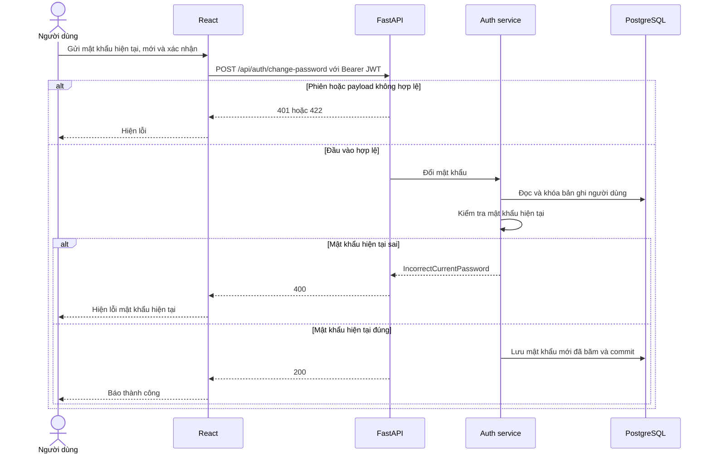
```mermaid
sequenceDiagram
    actor U as Người dùng
    participant UI as React
    participant API as FastAPI
    participant S as Auth service
    participant DB as PostgreSQL
    U->>UI: Gửi mật khẩu hiện tại, mới và xác nhận
    UI->>API: POST /api/auth/change-password với Bearer JWT
    alt Phiên hoặc payload không hợp lệ
        API-->>UI: 401 hoặc 422
        UI-->>U: Hiện lỗi
    else Đầu vào hợp lệ
        API->>S: Đổi mật khẩu
        S->>DB: Đọc và khóa bản ghi người dùng
        S->>S: Kiểm tra mật khẩu hiện tại
        alt Mật khẩu hiện tại sai
            S-->>API: IncorrectCurrentPassword
            API-->>UI: 400
            UI-->>U: Hiện lỗi mật khẩu hiện tại
        else Mật khẩu hiện tại đúng
            S->>DB: Lưu mật khẩu mới đã băm và commit
            API-->>UI: 200
            UI-->>U: Báo thành công
        end
    end
```

## 4. Mở Dashboard và chuyển tệp cũ

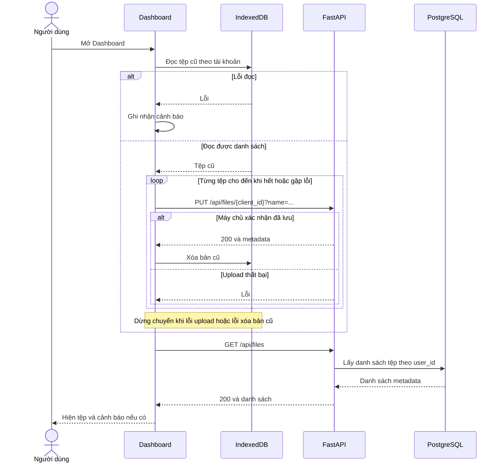
```mermaid
sequenceDiagram
    actor U as Người dùng
    participant UI as Dashboard
    participant IDB as IndexedDB
    participant API as FastAPI
    participant DB as PostgreSQL
    U->>UI: Mở Dashboard
    UI->>IDB: Đọc tệp cũ theo tài khoản
    alt Lỗi đọc
        IDB-->>UI: Lỗi
        UI->>UI: Ghi nhận cảnh báo
    else Đọc được danh sách
        IDB-->>UI: Tệp cũ
        loop Từng tệp cho đến khi hết hoặc gặp lỗi
            UI->>API: PUT /api/files/{client_id}?name=...
            alt Máy chủ xác nhận đã lưu
                API-->>UI: 200 và metadata
                UI->>IDB: Xóa bản cũ
            else Upload thất bại
                API-->>UI: Lỗi
            end
        end
        Note over UI,IDB: Dừng chuyển khi lỗi upload hoặc lỗi xóa bản cũ
    end
    UI->>API: GET /api/files
    API->>DB: Lấy danh sách tệp theo user_id
    DB-->>API: Danh sách metadata
    API-->>UI: 200 và danh sách
    UI-->>U: Hiện tệp và cảnh báo nếu có
```

## 5. Tải tệp nguồn lên

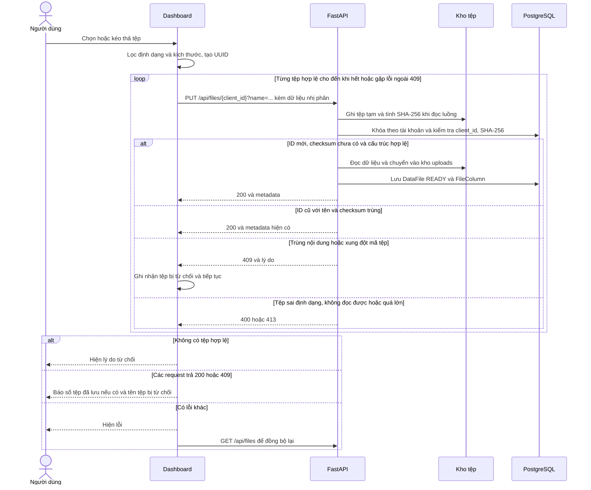
```mermaid
sequenceDiagram
    actor U as Người dùng
    participant UI as Dashboard
    participant API as FastAPI
    participant FS as Kho tệp
    participant DB as PostgreSQL
    U->>UI: Chọn hoặc kéo thả tệp
    UI->>UI: Lọc định dạng và kích thước, tạo UUID
    loop Từng tệp hợp lệ cho đến khi hết hoặc gặp lỗi ngoài 409
        UI->>API: PUT /api/files/{client_id}?name=... kèm dữ liệu nhị phân
        API->>FS: Ghi tệp tạm và tính SHA-256 khi đọc luồng
        API->>DB: Khóa theo tài khoản và kiểm tra client_id, SHA-256
        alt ID mới, checksum chưa có và cấu trúc hợp lệ
            API->>FS: Đọc dữ liệu và chuyển vào kho uploads
            API->>DB: Lưu DataFile READY và FileColumn
            API-->>UI: 200 và metadata
        else ID cũ với tên và checksum trùng
            API-->>UI: 200 và metadata hiện có
        else Trùng nội dung hoặc xung đột mã tệp
            API-->>UI: 409 và lý do
            UI->>UI: Ghi nhận tệp bị từ chối và tiếp tục
        else Tệp sai định dạng, không đọc được hoặc quá lớn
            API-->>UI: 400 hoặc 413
        end
    end
    alt Không có tệp hợp lệ
        UI-->>U: Hiện lý do từ chối
    else Các request trả 200 hoặc 409
        UI-->>U: Báo số tệp đã lưu nếu có và tên tệp bị từ chối
    else Có lỗi khác
        UI-->>U: Hiện lỗi
        UI->>API: GET /api/files để đồng bộ lại
    end
```

## 6. Cấu hình và chạy làm sạch dữ liệu

Kiểm tra kiểu đọc dữ liệu nguồn để giữ số dòng gốc. Các thao tác biến đổi dữ liệu chạy theo thứ tự gửi lên. Job xử lý đồng bộ trong request. Giao diện chờ tối thiểu 15 giây nếu người dùng tiếp tục chờ.

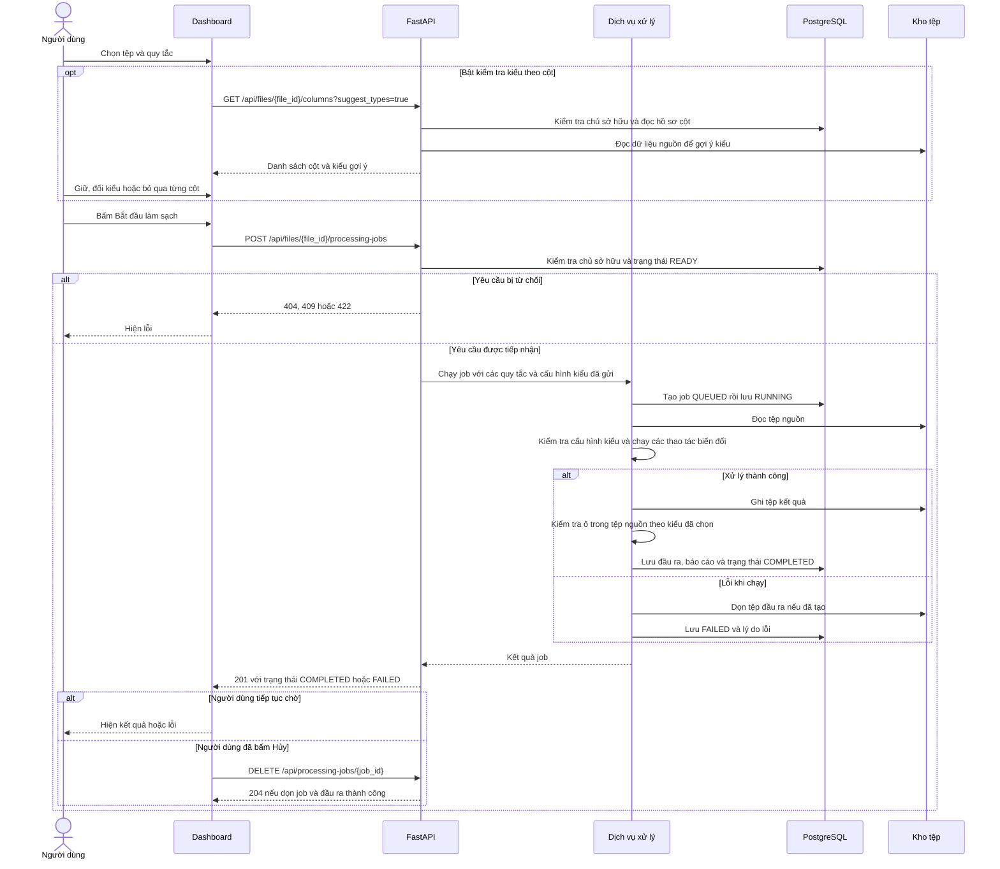
```mermaid
sequenceDiagram
    actor U as Người dùng
    participant UI as Dashboard
    participant API as FastAPI
    participant S as Dịch vụ xử lý
    participant DB as PostgreSQL
    participant FS as Kho tệp
    U->>UI: Chọn tệp và quy tắc
    opt Bật kiểm tra kiểu theo cột
        UI->>API: GET /api/files/{file_id}/columns?suggest_types=true
        API->>DB: Kiểm tra chủ sở hữu và đọc hồ sơ cột
        API->>FS: Đọc dữ liệu nguồn để gợi ý kiểu
        API-->>UI: Danh sách cột và kiểu gợi ý
        U->>UI: Giữ, đổi kiểu hoặc bỏ qua từng cột
    end
    U->>UI: Bấm Bắt đầu làm sạch
    UI->>API: POST /api/files/{file_id}/processing-jobs
    API->>DB: Kiểm tra chủ sở hữu và trạng thái READY
    alt Yêu cầu bị từ chối
        API-->>UI: 404, 409 hoặc 422
        UI-->>U: Hiện lỗi
    else Yêu cầu được tiếp nhận
        API->>S: Chạy job với các quy tắc và cấu hình kiểu đã gửi
        S->>DB: Tạo job QUEUED rồi lưu RUNNING
        S->>FS: Đọc tệp nguồn
        S->>S: Kiểm tra cấu hình kiểu và chạy các thao tác biến đổi
        alt Xử lý thành công
            S->>FS: Ghi tệp kết quả
            S->>S: Kiểm tra ô trong tệp nguồn theo kiểu đã chọn
            S->>DB: Lưu đầu ra, báo cáo và trạng thái COMPLETED
        else Lỗi khi chạy
            S->>FS: Dọn tệp đầu ra nếu đã tạo
            S->>DB: Lưu FAILED và lý do lỗi
        end
        S-->>API: Kết quả job
        API-->>UI: 201 với trạng thái COMPLETED hoặc FAILED
        alt Người dùng tiếp tục chờ
            UI-->>U: Hiện kết quả hoặc lỗi
        else Người dùng đã bấm Hủy
            UI->>API: DELETE /api/processing-jobs/{job_id}
            API-->>UI: 204 nếu dọn job và đầu ra thành công
        end
    end
```

Bấm Hủy đưa người dùng về trang làm sạch ngay. Request có thể tiếp tục chạy. Giao diện thử dọn job sau khi nhận được phản hồi có ID.

## 7. Tải tệp kết quả

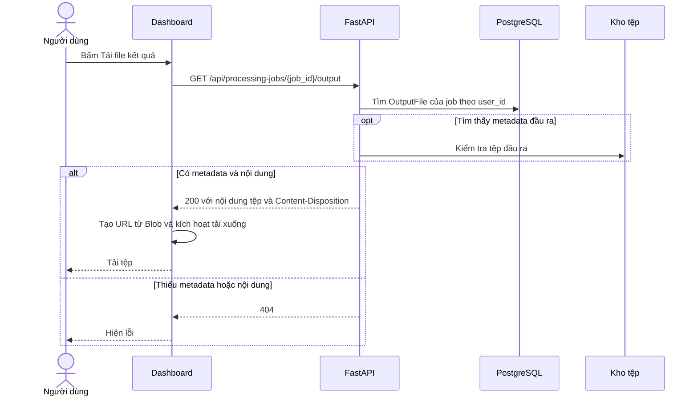
```mermaid
sequenceDiagram
    actor U as Người dùng
    participant UI as Dashboard
    participant API as FastAPI
    participant DB as PostgreSQL
    participant FS as Kho tệp
    U->>UI: Bấm Tải file kết quả
    UI->>API: GET /api/processing-jobs/{job_id}/output
    API->>DB: Tìm OutputFile của job theo user_id
    opt Tìm thấy metadata đầu ra
        API->>FS: Kiểm tra tệp đầu ra
    end
    alt Có metadata và nội dung
        API-->>UI: 200 với nội dung tệp và Content-Disposition
        UI->>UI: Tạo URL từ Blob và kích hoạt tải xuống
        UI-->>U: Tải tệp
    else Thiếu metadata hoặc nội dung
        API-->>UI: 404
        UI-->>U: Hiện lỗi
    end
```

## 8. Xóa tệp

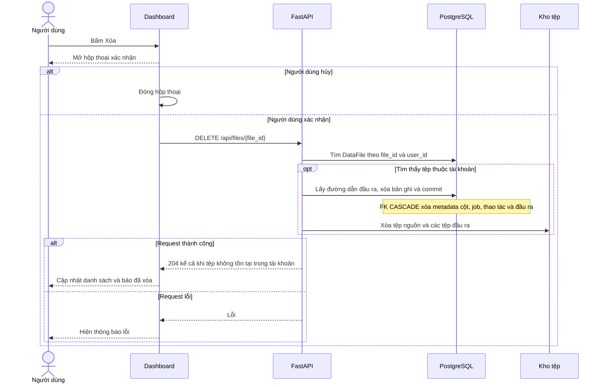
```mermaid
sequenceDiagram
    actor U as Người dùng
    participant UI as Dashboard
    participant API as FastAPI
    participant DB as PostgreSQL
    participant FS as Kho tệp
    U->>UI: Bấm Xóa
    UI-->>U: Mở hộp thoại xác nhận
    alt Người dùng hủy
        UI->>UI: Đóng hộp thoại
    else Người dùng xác nhận
        UI->>API: DELETE /api/files/{file_id}
        API->>DB: Tìm DataFile theo file_id và user_id
        opt Tìm thấy tệp thuộc tài khoản
            API->>DB: Lấy đường dẫn đầu ra, xóa bản ghi và commit
            Note over DB: FK CASCADE xóa metadata cột, job, thao tác và đầu ra
            API->>FS: Xóa tệp nguồn và các tệp đầu ra
        end
        alt Request thành công
            API-->>UI: 204 kể cả khi tệp không tồn tại trong tài khoản
            UI-->>U: Cập nhật danh sách và báo đã xóa
        else Request lỗi
            API-->>UI: Lỗi
            UI-->>U: Hiện thông báo lỗi
        end
    end
```

## 9. Tra cứu tệp và lịch sử xử lý qua API

Các endpoint này có trong backend. Dashboard hiện tại dùng danh sách tệp, tạo job và tải kết quả trực tiếp từ job vừa chạy. Các truy vấn dưới đây mô tả thêm những thao tác có thể thực hiện qua API.

| Truy vấn | Endpoint |
| --- | --- |
| Metadata cột theo thứ tự | `GET /api/files/{file_id}/columns` |
| Nội dung tệp nguồn | `GET /api/files/{file_id}/content` |
| Lịch sử job của tệp, mới nhất trước | `GET /api/files/{file_id}/processing-jobs` |
| Chi tiết job, các thao tác và đầu ra nếu có | `GET /api/processing-jobs/{job_id}` |

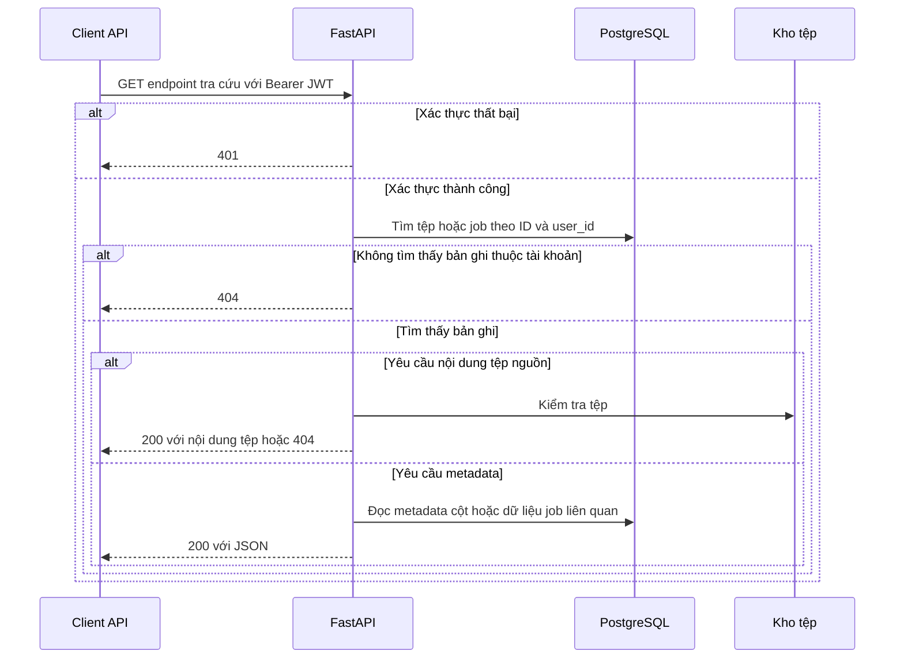
```mermaid
sequenceDiagram
    participant Client as Client API
    participant API as FastAPI
    participant DB as PostgreSQL
    participant FS as Kho tệp
    Client->>API: GET endpoint tra cứu với Bearer JWT
    alt Xác thực thất bại
        API-->>Client: 401
    else Xác thực thành công
        API->>DB: Tìm tệp hoặc job theo ID và user_id
        alt Không tìm thấy bản ghi thuộc tài khoản
            API-->>Client: 404
        else Tìm thấy bản ghi
            alt Yêu cầu nội dung tệp nguồn
                API->>FS: Kiểm tra tệp
                API-->>Client: 200 với nội dung tệp hoặc 404
            else Yêu cầu metadata
                API->>DB: Đọc metadata cột hoặc dữ liệu job liên quan
                API-->>Client: 200 với JSON
            end
        end
    end
```

## 10. Xem danh sách và xóa riêng tệp kết quả

Activity mô tả ba lựa chọn sau khi đã mở danh sách, gồm tải xuống, mở báo cáo và xóa. Sequence tập trung vào tải danh sách và xác nhận xóa. Nếu đầu ra đã vắng mặt trong phạm vi tài khoản, lệnh xóa vẫn trả `204`. Tệp nguồn và job tiếp tục tồn tại.

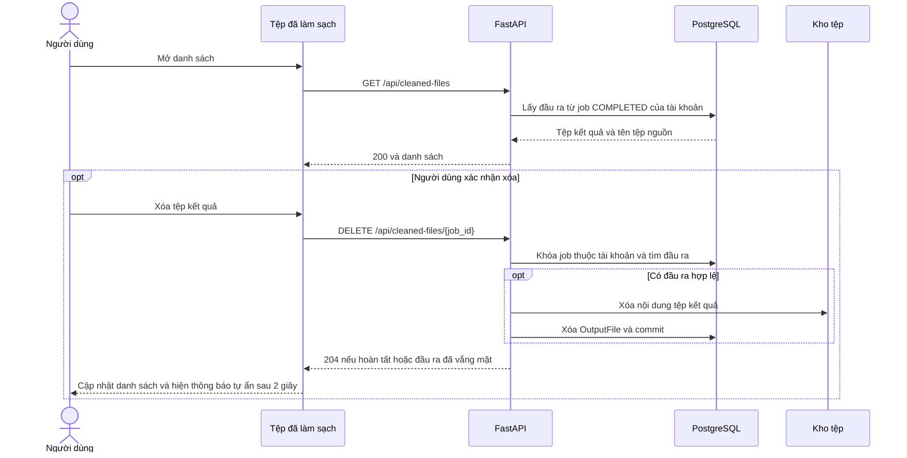
```mermaid
sequenceDiagram
    actor U as Người dùng
    participant UI as Tệp đã làm sạch
    participant API as FastAPI
    participant DB as PostgreSQL
    participant FS as Kho tệp
    U->>UI: Mở danh sách
    UI->>API: GET /api/cleaned-files
    API->>DB: Lấy đầu ra từ job COMPLETED của tài khoản
    DB-->>API: Tệp kết quả và tên tệp nguồn
    API-->>UI: 200 và danh sách
    opt Người dùng xác nhận xóa
        U->>UI: Xóa tệp kết quả
        UI->>API: DELETE /api/cleaned-files/{job_id}
        API->>DB: Khóa job thuộc tài khoản và tìm đầu ra
        opt Có đầu ra hợp lệ
            API->>FS: Xóa nội dung tệp kết quả
            API->>DB: Xóa OutputFile và commit
        end
        API-->>UI: 204 nếu hoàn tất hoặc đầu ra đã vắng mặt
        UI-->>U: Cập nhật danh sách và hiện thông báo tự ẩn sau 2 giây
    end
```

## 11. Xem chất lượng dữ liệu và tải bản ghi đáng ngờ

Trang Phân tích hiển thị báo cáo tổng hợp ngay dưới bộ chọn tệp ở cột trái. Mục Bản ghi đáng ngờ hiển thị các phát hiện chi tiết theo trang. Tệp Excel chứa toàn bộ phát hiện chi tiết của job. Danh sách, tổng số và tệp Excel đều bỏ các mục chỉ liên quan đến khoảng trắng. Báo cáo dùng dữ liệu nguồn trước khi làm sạch.

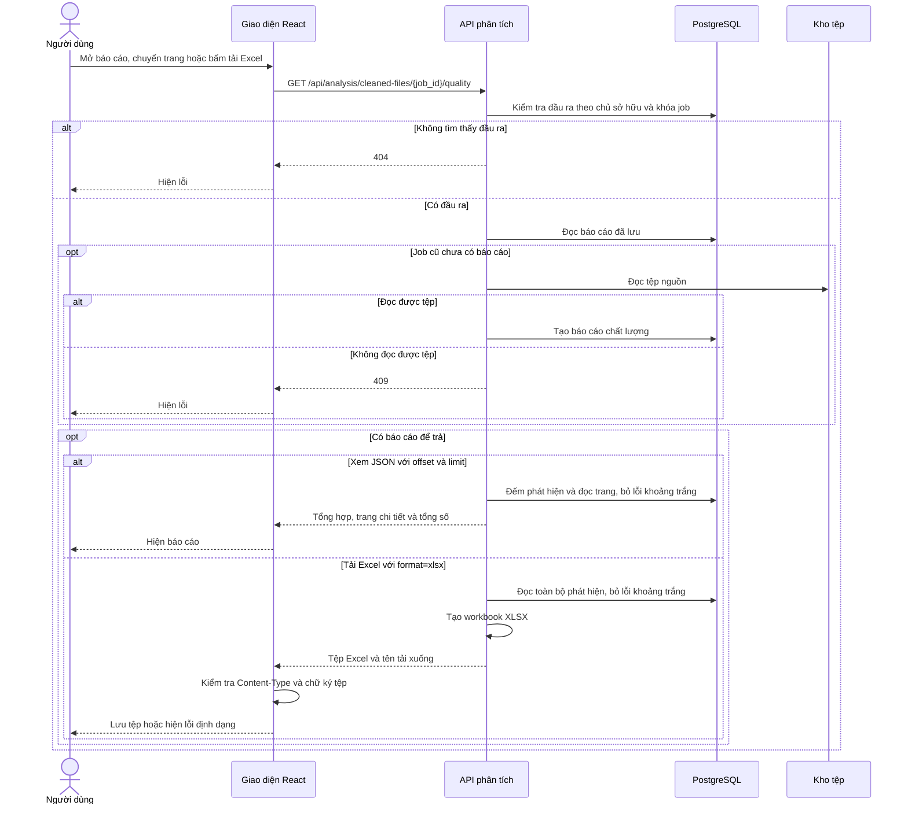
```mermaid
sequenceDiagram
    actor U as Người dùng
    participant UI as Giao diện React
    participant API as API phân tích
    participant DB as PostgreSQL
    participant FS as Kho tệp
    U->>UI: Mở báo cáo, chuyển trang hoặc bấm tải Excel
    UI->>API: GET /api/analysis/cleaned-files/{job_id}/quality
    API->>DB: Kiểm tra đầu ra theo chủ sở hữu và khóa job
    alt Không tìm thấy đầu ra
        API-->>UI: 404
        UI-->>U: Hiện lỗi
    else Có đầu ra
        API->>DB: Đọc báo cáo đã lưu
        opt Job cũ chưa có báo cáo
            API->>FS: Đọc tệp nguồn
            alt Đọc được tệp
                API->>DB: Tạo báo cáo chất lượng
            else Không đọc được tệp
                API-->>UI: 409
                UI-->>U: Hiện lỗi
            end
        end
        opt Có báo cáo để trả
            alt Xem JSON với offset và limit
                API->>DB: Đếm phát hiện và đọc trang, bỏ lỗi khoảng trắng
                API-->>UI: Tổng hợp, trang chi tiết và tổng số
                UI-->>U: Hiện báo cáo
            else Tải Excel với format=xlsx
                API->>DB: Đọc toàn bộ phát hiện, bỏ lỗi khoảng trắng
                API->>API: Tạo workbook XLSX
                API-->>UI: Tệp Excel và tên tải xuống
                UI->>UI: Kiểm tra Content-Type và chữ ký tệp
                UI-->>U: Lưu tệp hoặc hiện lỗi định dạng
            end
        end
    end
```

## 12. Kiểm tra trạng thái API

Health check xác nhận FastAPI phản hồi. Kết quả này kiểm tra endpoint sức khỏe của ứng dụng.

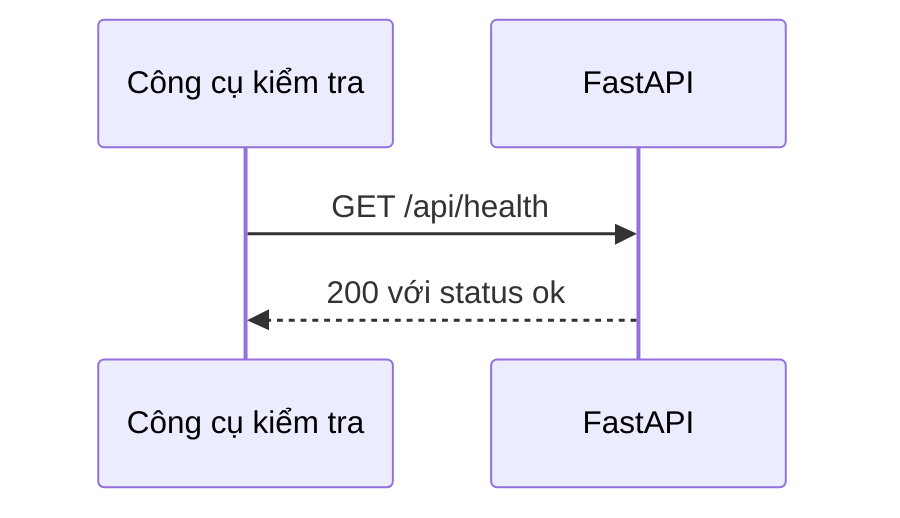
```mermaid
sequenceDiagram
    participant Client as Công cụ kiểm tra
    participant API as FastAPI
    Client->>API: GET /api/health
    API-->>Client: 200 với status ok
```

## 13. Khám phá hai cột và xem chi tiết biểu đồ

Biểu đồ sử dụng tệp đã làm sạch. Mỗi lượt so sánh xét các dòng có đủ giá trị ở cả hai cột. Khi xem theo giờ, một bản ghi trong khung 17:00–18:00 được đếm theo giờ ghi trong tệp, cộng dồn qua các ngày. Chế độ đếm mã khác nhau tính mỗi giá trị một lần trong từng khung giờ.

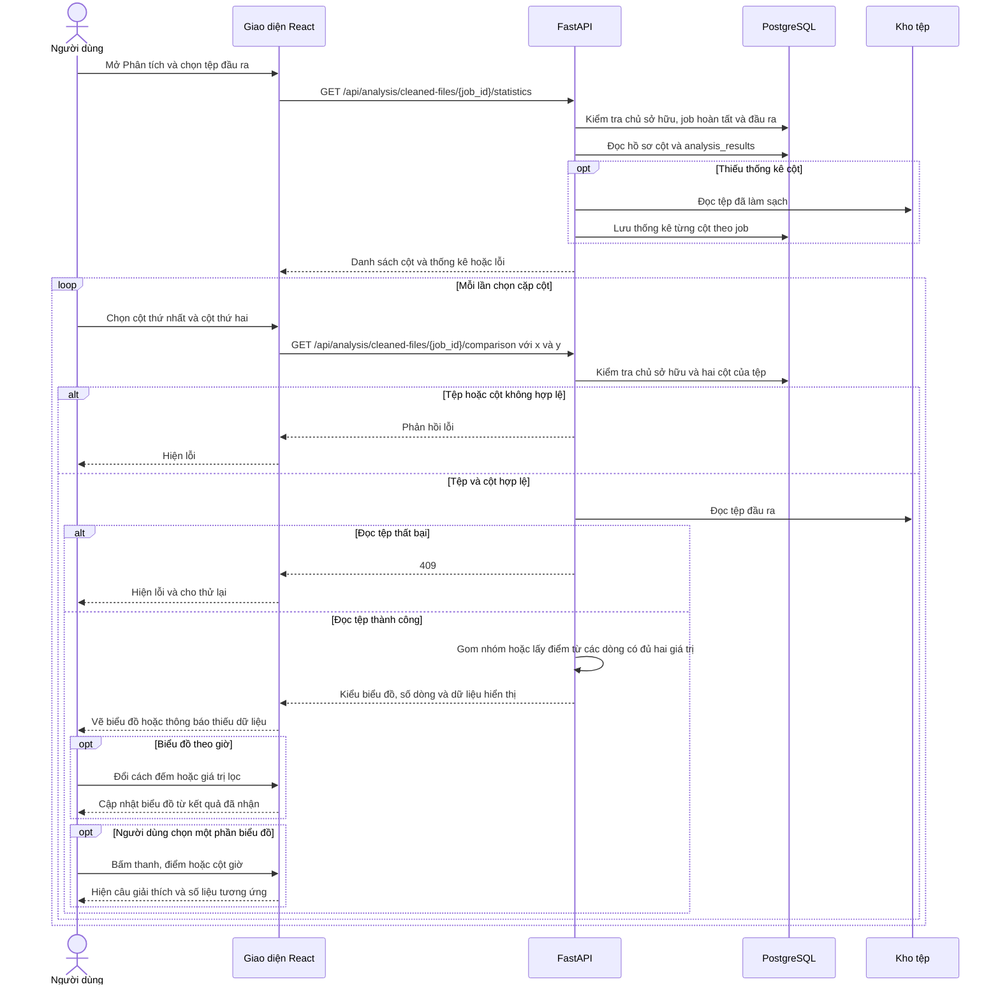
```mermaid
sequenceDiagram
    actor U as Người dùng
    participant UI as Giao diện React
    participant API as FastAPI
    participant DB as PostgreSQL
    participant FS as Kho tệp
    U->>UI: Mở Phân tích và chọn tệp đầu ra
    UI->>API: GET /api/analysis/cleaned-files/{job_id}/statistics
    API->>DB: Kiểm tra chủ sở hữu, job hoàn tất và đầu ra
    API->>DB: Đọc hồ sơ cột và analysis_results
    opt Thiếu thống kê cột
        API->>FS: Đọc tệp đã làm sạch
        API->>DB: Lưu thống kê từng cột theo job
    end
    API-->>UI: Danh sách cột và thống kê hoặc lỗi
    loop Mỗi lần chọn cặp cột
        U->>UI: Chọn cột thứ nhất và cột thứ hai
        UI->>API: GET /api/analysis/cleaned-files/{job_id}/comparison với x và y
        API->>DB: Kiểm tra chủ sở hữu và hai cột của tệp
        alt Tệp hoặc cột không hợp lệ
            API-->>UI: Phản hồi lỗi
            UI-->>U: Hiện lỗi
        else Tệp và cột hợp lệ
            API->>FS: Đọc tệp đầu ra
            alt Đọc tệp thất bại
                API-->>UI: 409
                UI-->>U: Hiện lỗi và cho thử lại
            else Đọc tệp thành công
                API->>API: Gom nhóm hoặc lấy điểm từ các dòng có đủ hai giá trị
                API-->>UI: Kiểu biểu đồ, số dòng và dữ liệu hiển thị
                UI-->>U: Vẽ biểu đồ hoặc thông báo thiếu dữ liệu
                opt Biểu đồ theo giờ
                    U->>UI: Đổi cách đếm hoặc giá trị lọc
                    UI-->>U: Cập nhật biểu đồ từ kết quả đã nhận
                end
                opt Người dùng chọn một phần biểu đồ
                    U->>UI: Bấm thanh, điểm hoặc cột giờ
                    UI-->>U: Hiện câu giải thích và số liệu tương ứng
                end
            end
        end
    end
```

## 14. Khởi động backend và chuyển dữ liệu lưu trữ cũ

FastAPI chạy bước chuẩn bị kho tệp và cơ sở dữ liệu khi khởi động. Bước chuyển sang kho tệp áp dụng cho bảng PostgreSQL `uploaded_files` cũ. Mục 4 mô tả luồng chuyển tệp đã lưu trong trình duyệt.

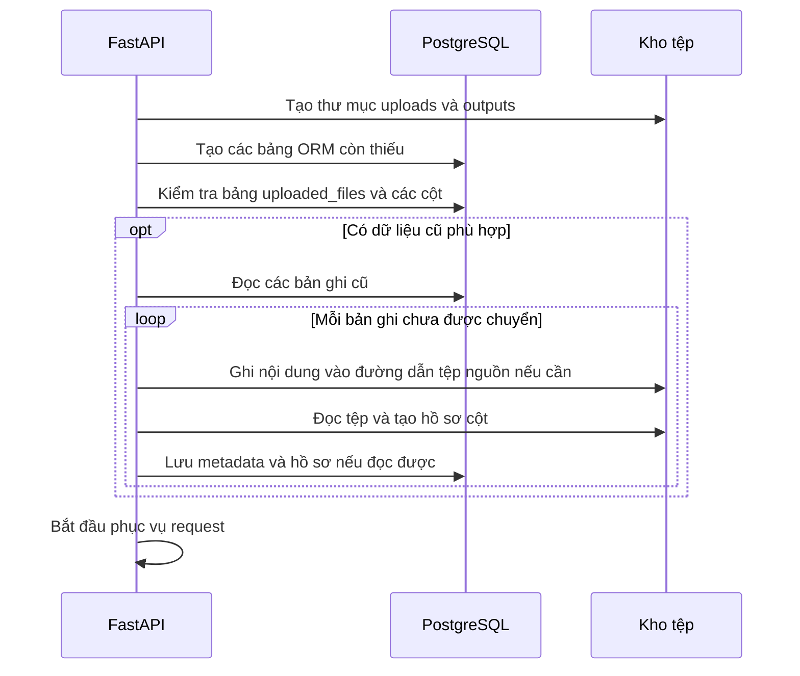
```mermaid
sequenceDiagram
    participant API as FastAPI
    participant DB as PostgreSQL
    participant FS as Kho tệp
    API->>FS: Tạo thư mục uploads và outputs
    API->>DB: Tạo các bảng ORM còn thiếu
    API->>DB: Kiểm tra bảng uploaded_files và các cột
    opt Có dữ liệu cũ phù hợp
        API->>DB: Đọc các bản ghi cũ
        loop Mỗi bản ghi chưa được chuyển
            API->>FS: Ghi nội dung vào đường dẫn tệp nguồn nếu cần
            API->>FS: Đọc tệp và tạo hồ sơ cột
            API->>DB: Lưu metadata và hồ sơ nếu đọc được
        end
    end
    API->>API: Bắt đầu phục vụ request
```

## Mã nguồn đối chiếu

- [React App và phiên đăng nhập](../../frontend/src/App.jsx)
- [Giao diện tài khoản](../../frontend/src/modules/authentication)
- [Dashboard](../../frontend/src/pages/dashboard/Dashboard.jsx)
- [Frontend client cho tệp và job](../../frontend/src/modules/dashboard/data/serverFileStorage.js)
- [API xác thực](../../backend/app/api/routes/auth.py), [middleware](../../backend/app/api/middlewares/authentication.py), [dịch vụ xác thực](../../backend/app/modules/authentication/service.py)
- [API tệp](../../backend/app/api/routes/files.py), [API job](../../backend/app/api/routes/processing.py), [dịch vụ xử lý](../../backend/app/modules/processing/service.py)
- [API phân tích](../../backend/app/api/routes/analysis.py), [quy tắc báo cáo](../../backend/app/modules/processing/quality.py)
- [Trang khách](../../frontend/src/pages/guest-home/GuestHome.jsx), [trang Phân tích](../../frontend/src/pages/analysis/Analysis.jsx), [biểu đồ hai cột](../../frontend/src/pages/analysis/ColumnStatistics.jsx)
- [Tính thống kê và so sánh](../../backend/app/modules/processing/statistics.py), [model thống kê](../../backend/app/models/analysis_result.py)
- [Vòng đời FastAPI](../../backend/app/main.py), [chuyển dữ liệu cũ](../../backend/app/db/migrations.py)
